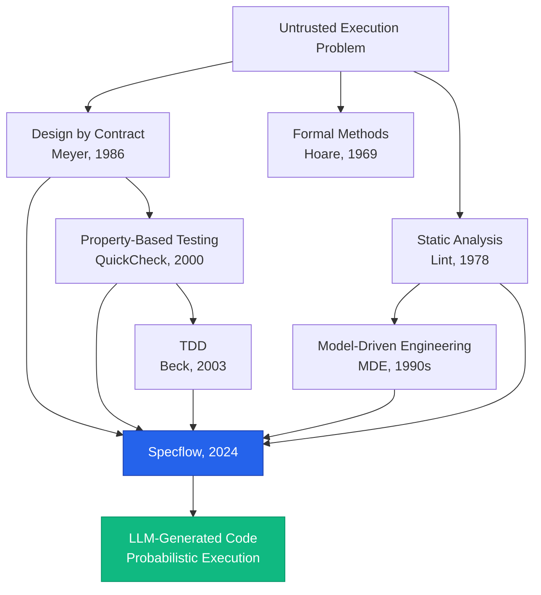

# Origins & Academic Foundation
{: .no_toc }

> **"We already knew how to control untrusted execution. We just forgot — until LLMs forced us to remember."**

---

## Table of contents
{: .no_toc .text-delta }

1. TOC
{:toc}

---

## The Forgotten Lesson

In the 1980s, computer scientists faced a problem: **How do you verify program correctness when you can't trust the implementation?**

They invented:
- **Design by Contract** (Meyer, 1986) — Preconditions, postconditions, invariants
- **Formal Methods** (Hoare logic, 1969) — Mathematical proofs of correctness
- **Static Analysis** (Lint, 1978) — Automated code scanning

**The core insight:** Define boundaries. Verify them automatically. Block execution if violated.

---

## Why These Tools Faded

### The Deterministic Era (1990-2020)

When humans write code:
- ✅ Execution is deterministic
- ✅ Violations are rare bugs (not normal behavior)
- ✅ Review scales (humans review what humans generate)

**Old tools became optional:**
- DbC? "Too heavyweight" (abandoned outside Eiffel)
- Formal methods? "Academic only" (industry ignored)
- Static analysis? "Nice to have" (ESLint is opt-in)

**Why they faded:** Review worked. Humans could keep up.

---

## The LLM Shift (2023+)

LLMs changed the failure mode:

### Before LLMs
- Slow generation (humans write ~50-100 lines/day)
- Deterministic behavior (same inputs → same outputs)
- Violations are bugs (rare, fixable)

### After LLMs
- **Infinite generation** (LLMs write 1000s of lines/hour)
- **Probabilistic behavior** (same prompt → different outputs)
- **Violations are normal** (drift, hallucination, misalignment)

**The lesson we forgot:** Review doesn't scale. Containment does.

---

## The Intellectual Lineage

Specflow synthesizes 40+ years of research:

### 1. Design by Contract (DbC) — Eiffel, 1986

**Inventor:** Bertrand Meyer

**Core idea:**
- **Preconditions:** What must hold before a function runs
- **Postconditions:** What must hold after a function runs
- **Invariants:** What must always hold

**Example:**
```eiffel
deposit (amount: INTEGER)
  require
    amount_positive: amount > 0
  ensure
    balance_increased: balance = old balance + amount
```

**Why Specflow is different:**

| DbC (Eiffel) | Specflow |
|--------------|----------|
| Author = executor | **Executor is untrusted (LLM)** |
| Violations are bugs | **Violations are normal behavior** |
| Assertions at runtime | **Verification at test time** |
| Function-level contracts | **System-level contracts** |

**The critical difference:** DbC assumes alignment. Specflow does not.

---

### 2. Property-Based Testing — QuickCheck, 2000

**Inventors:** Koen Claessen, John Hughes

**Core idea:** Instead of writing example-based tests, define **properties** that should hold for all inputs.

**Example:**
```haskell
-- Property: Reversing twice returns original
prop_reverse xs = reverse (reverse xs) == xs
```

QuickCheck generates random inputs and verifies the property holds.

**Why Specflow extends it:**

| QuickCheck | Specflow |
|------------|----------|
| Properties for **functions** | Properties for **systems, architectures, workflows** |
| Random input generation | **Real user workflows (journeys)** |
| Output: Boolean (pass/fail) | **Output: Actionable violations** |

**Specflow is property-based testing for creative systems.**

---

### 3. Test-Driven Development (TDD) — Kent Beck, 2003

**Core idea:** Write tests before implementation. Tests gate progress.

**Example workflow:**
```
1. Write failing test
2. Write minimal code to pass
3. Refactor
4. Repeat
```

**Why Specflow is different:**

| TDD | Specflow |
|-----|----------|
| Tests verify **correctness** | Tests enforce **containment** |
| You write code to pass tests | **LLM writes code to pass tests** |
| Failures indicate bugs | **Failures indicate drift** |

**Specflow isn't about correctness. It's about containment.**

---

### 4. Model-Driven Engineering (MDE) — 1990s

**Core idea:** Generate code from formal models (UML, DSLs).

**Why MDE failed:**
- Required **complete upfront models** (too rigid)
- **Heavy tooling** (specialized IDEs, languages)
- **Slow generation** (days/weeks to generate code)
- **Brittle failures** (model changes broke everything)

**Why Specflow works:**

| MDE | Specflow |
|-----|----------|
| Complete upfront models | **Partial contracts (only what matters)** |
| Heavy tooling | **YAML files + tests** |
| Slow generation | **Minutes (LLM-powered)** |
| Brittle failures | **Informative failures (tests tell you what's wrong)** |

**Specflow is the lightweight version MDE always wanted to be.**

---

### 5. Static Analysis — Lint, 1978

**Core idea:** Scan code for patterns that indicate bugs.

**Example (ESLint):**
```javascript
// Rule: No unused variables
let x = 5  // ❌ ESLint error: 'x' is assigned but never used
```

**Why Specflow democratizes it:**

| Lint (ESLint, etc.) | Specflow |
|---------------------|----------|
| Rules defined in code (AST traversal) | **Rules defined in YAML (human-readable)** |
| Expert-only rule creation | **Non-experts can write contracts** |
| Syntax and patterns | **Architecture and business logic** |

**Specflow makes custom static analysis accessible.**

---

## The Concept Map



**Specflow didn't invent the principles. It applied them to a new problem: probabilistic code generation.**

---

## The Academic Claim

**Specflow is NOT:**
- A new theory (it synthesizes existing research)
- A formal methods framework (it's pragmatic, not rigorous)
- A replacement for TDD (it complements it)

**Specflow IS:**
- **Applied research** (DbC + QuickCheck + static analysis)
- **A containment system** for untrusted execution
- **A compiler for architecture** (like TypeScript is a compiler for types)

**The novelty:** Adapting old principles to LLM-generated code.

---

## The HCI Angle (Formalizing Editing)

**Thesis:** LLMs made code generation cheap. But editing is still expensive.

**Traditional editing:**
```
Human reads code → Identifies issue → Edits manually → Re-reads → Repeat
```

**Time:** Hours per feature

**Specflow editing:**
```
Define contracts → LLM generates → Tests reject violations → Ship or stop
```

**Time:** Minutes per feature

**The insight:** If you can formalize **what should hold**, you can skip manual review.

**This is HCI research:**
- How do you reduce cognitive load in code review?
- How do you make editing scale with infinite generation?

**Specflow's answer:** Offload review to automated tests. Humans only intervene on failures.

---

## The Research References

### Foundational Papers

1. **Meyer, B. (1992).** *Applying "Design by Contract"*. IEEE Computer, 25(10), 40-51.
   - Original DbC framework
   - Preconditions, postconditions, invariants

2. **Claessen, K., & Hughes, J. (2000).** *QuickCheck: A Lightweight Tool for Random Testing of Haskell Programs*. ICFP.
   - Property-based testing foundation
   - Random input generation

3. **Beck, K. (2003).** *Test-Driven Development: By Example*. Addison-Wesley.
   - TDD methodology
   - Red-green-refactor loop

4. **Hoare, C. A. R. (1969).** *An Axiomatic Basis for Computer Programming*. Communications of the ACM, 12(10), 576-580.
   - Formal verification foundations
   - Hoare logic (preconditions/postconditions)

5. **Johnson, S. C. (1978).** *Lint, a C Program Checker*. Bell Labs.
   - Static analysis origins
   - Pattern-based bug detection

### Modern Context

6. **Breck, E., et al. (2019).** *Data Validation for Machine Learning*. SysML.
   - Validating ML pipeline outputs
   - Similar challenge: untrusted execution

7. **Ribeiro, M. T., et al. (2020).** *Beyond Accuracy: Behavioral Testing of NLP Models*. ACL.
   - Testing probabilistic systems
   - Property-based testing for ML

**Specflow extends these principles to LLM-generated code.**

---

## Disclaimers

### What Specflow Does NOT Claim

1. **NOT a formal verification system**
   - Specflow uses tests (heuristic), not proofs (rigorous)
   - Failures are informative, not exhaustive

2. **NOT a replacement for human judgment**
   - Contracts must be written by humans
   - Humans decide what matters (contracts don't infer)

3. **NOT a general AI safety solution**
   - Specflow scopes to code generation
   - Not applicable to alignment, AGI, etc.

### What Specflow DOES Claim

1. **Contracts reduce review burden**
   - 3-4x faster than manual workflows (measured on production projects)
   - <5% contract violation rate after initial setup

2. **Tests enforce architectural boundaries**
   - Contract violations block PRs (like type errors)
   - Journeys define "done" (like acceptance tests)

3. **Old theory applies to new failure modes**
   - DbC, QuickCheck, TDD, static analysis still work
   - LLMs just made containment urgent again

**Specflow is pragmatic, not academic. It works because the principles are proven.**

---

## The Forgotten Lesson, Rediscovered

> **"Control untrusted execution with boundaries. Verify automatically. Block on violation."**

We knew this in 1986. We forgot. LLMs forced us to remember.

**Specflow is not new theory. It's old theory, applied to probabilistic code generation.**

---

## Next Steps

- **[Why Now?](/background/why-now/)** — The LLM shift that made Specflow necessary
- **[Manual Contracts](/advanced/manual-contracts/)** — Write contracts by hand (DbC-style)
- **[Contract Schema](/reference/contract-schema/)** — YAML format specification

---

## Compiler Analogy Reminder

> **TypeScript didn't invent type checking. It applied it to JavaScript.**
>
> **Specflow didn't invent contracts. It applied them to LLM-generated code.**

Same pattern. Different domain.

**Old tools for a new problem.**
